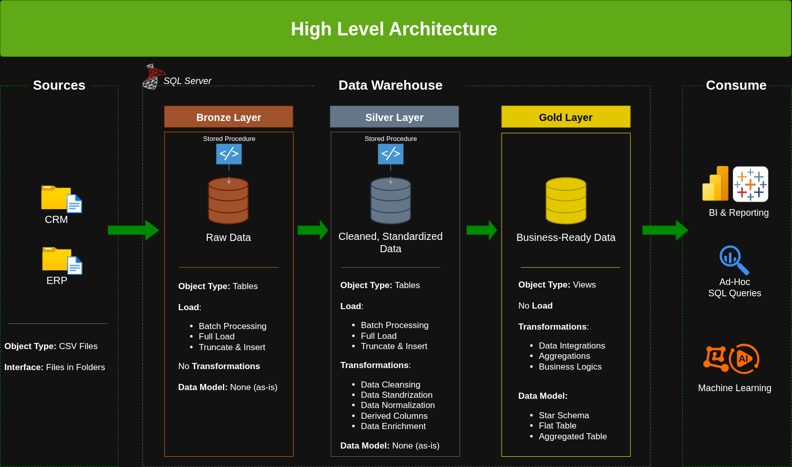

# A Curious Adventure in Data: Warehouse & Analytics Project

### ✨ Welcome, Fellow Explorer!

So you want to look at data, eh? Not just look at it—really understand it!
It’s like nature’s own puzzle: raw, messy numbers over here… clean, shining insights over there.
And in between? That’s where the fun is.

In this project, I took a pile of data—like two different jars of assorted nuts and bolts—and built a tidy, organized workshop where you can actually build something with them.

---
## 🏗️ Data Architecture

The data architecture for this project follows Medallion Architecture **Bronze**, **Silver**, and **Gold** layers:

1. **Bronze Layer**: Stores raw data as-is from the source systems. Data is ingested from CSV Files into SQL Server Database.
2. **Silver Layer**: This layer includes data cleansing, standardization, and normalization processes to prepare data for analysis.
3. **Gold Layer**: Houses business-ready data modeled into a star schema required for reporting and analytics.

---

## 🏗️ How It’s Organized: The Medallion Layers

Imagine you’re panning for gold:

### Bronze Layer — The Raw Ore

Here’s where the data lands exactly as it comes—no polish, no changes.

Like scribbles in a lab notebook: sometimes messy, but always true to the source.

In this project: CSV files → SQL Server, as-is.

### Silver Layer — Refining the Ingots

Now we clean, straighten, and make sense of things.

Remove the dirt, fix what’s broken, and put everything in the same “language.”

Ready for the next step? You bet.

### Gold Layer — The Polished Gems
Here’s where we shape the data into something useful.

I built a star schema—like constellations! A bright fact table in the middle, dimension tables sparkling around it.

Now the business can ask questions, and the data answers.

---

## 📖 What’s Actually in Here?

This project involves:

1. **Data Architecture**— A Modern Data Warehouse, built layer-by-layer. Like **Bronze**, **Silver**, and **Gold** layers.
2. **ETL Pipelines**— Moving, reshaping, and polishing data, step-by-step.
3. **Data Modeling**— Stars! (The schema kind, not the astronomical kind… though both organize chaos beautifully.)
4. **Analytics & Reporting**— SQL queries that tell stories: what customers do, which products shine, where sales are flowing.

---

## Project Requirements:- 🚀 The Mission (If You Choose to Accept It)

### Part 1: Building the Workshop (Data Engineering)

**Goal**: Make a tidy, reliable data warehouse in SQL Server.

**Sources**: Two CSV files (ERP & CRM) — like two different dialects of “sales.”

**Cleaning**: Fix the quirks before anyone tries to measure anything.

**Integration**: One unified model, built for curious minds and fast questions.

**Documentation**: So you don’t have to guess how the gears turn.

---

## Part 2: Discovering Patterns (Data Analysis)

**Goal**: Use SQL to find the hidden rhythms in the noise.

**Look at**: What customers love, what products sell, where the trends are going.

**Why?** So decisions aren’t guesses—they’re inferences drawn from the data.

---

### BI: Analytics & Reporting (Data Analysis)

#### Objective
Develop SQL-based analytics to deliver detailed insights into:
- **Customer Behavior**
- **Product Performance**
- **Sales Trends**

These insights empower stakeholders with key business metrics, enabling strategic decision-making. 

---

### 🛡️ License

This project is licensed under the [MIT License](LICENSE). You are free to use, modify, and share this project with proper attribution.

### 🌟 About Me

Hello! I’m Ankit Malik.
I like to build data pipelines so that clean, useful information flows where it’s needed.
I transform, organize, and protect data so others can ask great questions and get clear answers.

### 🚀 What I Do:

Designing systems that handle data at scale.

Turning raw data into structured insight.

Making sure data stays trustworthy, from source to dashboard.

Teaming up with smart people to solve real puzzles.

----

##### Let's stay in touch! Feel free to connect with me on Linkedin:

#### www.linkedin.com/in/ankitmalik81680

